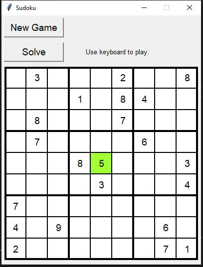
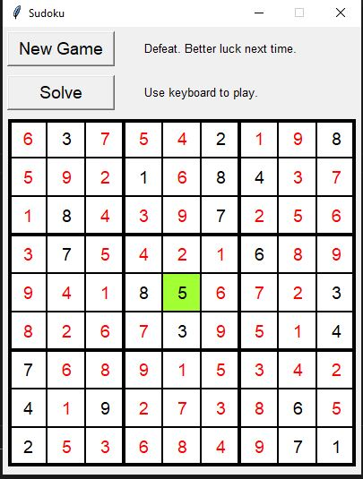

# Sudoku
Sudoku game with unique solution grid.  
Used a backtracking algorithm ( Depth-First Search ) to solve the grid, not really the optimised algorithm but it's sufficient for this case.  
GUI made with Tkinter library.

